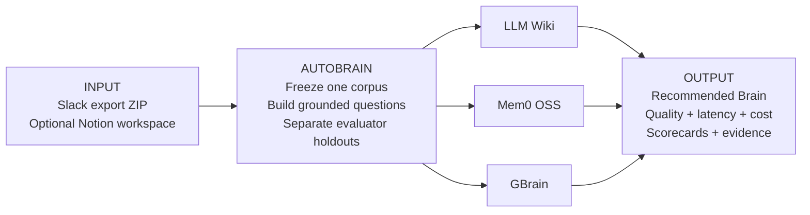
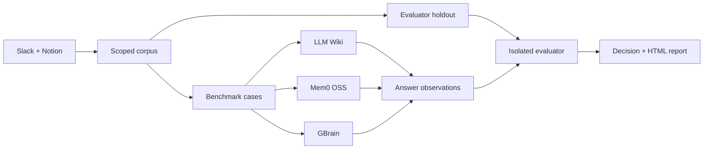
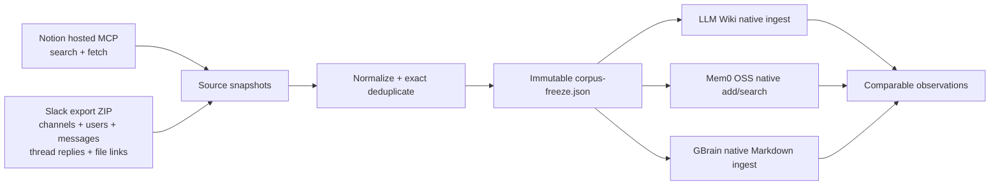

# AutoBrain

<p align="center">
  <strong>Which Brain should your company build on?</strong>
  <br />
  Automatically evaluate LLM Wiki, Mem0 OSS, and GBrain against your real Slack and Notion knowledge.
</p>

<p align="center">
  <a href="https://github.com/runbear-io/AutoBrain">
    
  </a>
  <a href="https://www.python.org/">
    
  </a>
  <a href="https://docs.astral.sh/uv/">
    
  </a>
  <a href="https://github.com/runbear-io/AutoBrain/blob/main/pyproject.toml">
    
  </a>
</p>

Your company wants an AI Brain: a knowledge and memory architecture that can
answer questions from the information your team already has. But which one
should you actually build on?

- **LLM Wiki**
- **Mem0 OSS**
- **GBrain**

AutoBrain is an **automatic evaluation and best-Brain selection tool** for that
decision. It tests the candidates with the same company data and grounded
questions, compares the three core outcomes—**quality, latency, and cost**—then
recommends the strongest eligible Brain. Evidence support and reliability act
as safety gates, and AutoBrain honestly returns `NO_RECOMMENDATION` when the
evidence is not good enough.

## Input → evaluation → output



### Input

| Input | What AutoBrain uses it for |
| --- | --- |
| **Slack Workspace Export ZIP** | Team messages, channels, threads, people, and exported file links |
| **Notion connection** *(optional)* | Pages and workspace knowledge available through read-only MCP |
| **Brain candidates** | Any two or all three of LLM Wiki, Mem0 OSS, and GBrain |
| **ChatGPT subscription** | Grounded benchmark generation and isolated evaluation |

AutoBrain normalizes the selected sources once and freezes them into one
immutable corpus. Every candidate receives that same corpus and the same
questions; evaluator-only holdout evidence is never exposed to the candidates.

### Expected output

Every completed run produces an inspectable recommendation shaped like this:

```text
RECOMMENDED BRAIN
  <LLM Wiki | Mem0 OSS | GBrain | NO_RECOMMENDATION>

WHY
  Highest eligible answer quality, or—when quality is close—
  the better measured cost, query latency, and operating burden.

CANDIDATE SCORECARDS
  Quality /100          Query p50 / p95         Measured cost
  Answer success        Source support          Contradictions
  Partial failures      Generated cases         Run status

EVIDENCE
  Source coverage       Per-question scores     Safe source links
  Corpus hash           Benchmark hash          Reopenable HTML report
```

The output is not a generic vendor ranking. It answers which candidate
performed best for the frozen Slack and Notion knowledge in that specific run.
Secondary telemetry that a candidate does not expose remains `unknown`; it is
never guessed or silently treated as zero.

## What AutoBrain compares

AutoBrain compares every Brain on three core dimensions:

| Core dimension | Measurement | How it affects the recommendation |
| --- | --- | --- |
| **Quality** | Grounded answer score from **0–100** | Primary decision dimension; the highest eligible quality wins |
| **Latency** | Per-question **p50 and p95** query time | Breaks close-quality ties after cost |
| **Cost** | Complete measured candidate cost in USD | Required eligibility evidence and the first close-quality tie-break |

These dimensions are not hidden inside one opaque blended score. The current
selection policy is deliberately **quality-first**: AutoBrain first protects
answer quality, then uses measured cost and latency to choose between candidates
whose quality is close.

### Quality score breakdown

Answer quality is scored out of 100 using the fixed rubric implemented by
AutoBrain:

| Quality metric | Weight | What it asks |
| --- | ---: | --- |
| **Required-claim coverage** | **45** | Did the answer include the facts needed to answer the question? |
| **Cited source support** | **25** | Are those claims supported by the correct company sources? |
| **Contradiction safety** | **20** | Did the answer avoid known contradictions and forbidden claims? |
| **Answer usability** | **10** | Did it return a non-empty answer with usable source citations? |

### Eligibility and selection policy

A high quality score alone is not enough. A candidate is eligible to become the
recommended Brain only when all of these gates pass:

| Eligibility gate | Requirement |
| --- | ---: |
| Scored benchmark cases | At least **20** |
| Answer success rate | At least **90%** |
| Mean quality | At least **60/100** |
| Source-support rate | At least **50%** |
| Provenance integrity | Valid candidate pin and corpus hash |
| Evaluation isolation | No direct holdout or oracle leakage |
| Cost evidence | Complete measured cost, never an assumed `$0` |
| Reliability | Successful status with no partial failures |

AutoBrain then applies the comparison in this order:

1. If one eligible candidate leads by more than **5 quality points**, the
   higher-quality Brain wins.
2. If candidates are within **5 quality points**, the lower complete measured
   cost wins.
3. If measured cost is tied, the lower p95 query latency wins.
4. Remaining ties use lower operating burden, then stable candidate ID order.

The run artifacts also record answer success, source support, contradiction
count, input/output tokens, ingest and query time, p50/p95 latency, workspace
size, source coverage, candidate failures, and the evidence behind each scored
case. Measurements unavailable from a candidate remain explicitly incomplete.

## Start here

### 1. Install AutoBrain once

```bash
brew install runbear-io/autobrain/autobrain
```

After installation, `autobrain` works from any directory. This formula currently
targets Apple Silicon macOS.

### 2. Connect ChatGPT

```bash
autobrain subscription setup
```

The ChatGPT subscription is required for grounded question generation and
isolated evaluation. This command opens an explicit user-driven authorization
flow. An OpenAI API key is not required.

### 3. Download your Slack export

In Slack, open:

```text
Admin -> Workspace settings -> Security -> Import & export data -> Export
```

Choose a date range, start the export, and download the ZIP when Slack emails
you. Keep the file zipped. See the
[friendly Slack export guide](docs/slack-export-guide.md) for permissions,
plan limitations, and troubleshooting.

### 4. Give AutoBrain the ZIP

```bash
autobrain source slack --export ~/Downloads/slack-export.zip
```

AutoBrain validates the archive and stores only its local path, SHA-256, and a
non-sensitive summary. It does not create a second permanent copy.

### 5. Optionally connect Notion

```bash
autobrain auth notion
```

Notion is optional when you want both knowledge sources in the same experiment.
The command opens an explicit user-driven authorization flow. A Notion API
token is not required.

### 6. Run the comparison

```bash
autobrain
```

Review the selected sources and candidates, then press `Enter`. AutoBrain
freezes the corpus, separates evaluation holdouts, runs each candidate through
its native lifecycle, and writes an HTML report.

## Why AutoBrain

Most AI knowledge evaluations fail in one of two ways:

1. The questions are synthetic, so the result does not represent the team.
2. The evidence and evaluation set overlap, so the score is quietly inflated.

AutoBrain is designed around the opposite defaults:

- **Real questions** from the connected knowledge sources.
- **Candidate-visible corpus** separated from **evaluator holdout evidence**.
- **Native candidate lifecycles** instead of forcing every system into one fake
  retriever abstraction.
- **Run-local metering** with a hard budget boundary.
- **Typed blockers** when authentication, capability, or evidence is missing.
- **Durable artifacts** for the corpus, benchmark, observations, decision, and
  HTML report.

## How it works



Every run is a new immutable run directory. A failed run remains inspectable;
the next invocation receives a new run ID rather than silently resuming or
overwriting previous evidence.

## Terminal cockpit

After installing AutoBrain once, run it without a subcommand:

```bash
autobrain
```

```text
AUTOBRAIN
One grounded experiment. You choose ChatGPT, knowledge sources, and candidates.

> 1  ChatGPT
   [C] ChatGPT      connected      (reconnect)

  2  Knowledge
   [S] [x] Slack        export ready   (reconnect)
   [N] [x] Notion       connected      (reconnect)

  3  Candidates
   [1] [x] LLM Wiki
   [2] [x] Mem0 OSS
   [3] [x] GBrain

  4  Automatic Experiment
   Find the best knowledge system for Slack + Notion
   Compare LLM Wiki, Mem0 OSS, GBrain on grounded questions from Slack + Notion.
   Provider     ChatGPT subscription
   Questions    automatic, up to 30
   Budget guard automatic, $25
```

The cockpit requires an interactive terminal of at least `60x23` cells.
Smaller terminals show a resize message and do not allow hidden setup state to
change.

### What you choose

| Setup section | Available choices |
| --- | --- |
| **ChatGPT** | Connect or reconnect the ChatGPT subscription |
| **Knowledge** | Slack export and/or Notion, plus whether this run uses them |
| **Candidates** | LLM Wiki, Mem0 OSS, GBrain |

All sources and candidates start selected. A runnable experiment requires at
least one knowledge source and at least two candidates.

### What AutoBrain decides

| Decision | Automatic behavior |
| --- | --- |
| Experiment | Generates a title and description from the selected scope |
| Provider | Uses the connected ChatGPT subscription |
| Questions | Up to 20 for one source, up to 30 for both sources |
| Budget | `$25` hard guard |
| Execution | Builds only the selected connectors and native candidate adapters |
| Output | Writes a new immutable run and evidence-backed result |

If the ChatGPT subscription is unavailable, AutoBrain returns its exact typed
status, such as `SUBSCRIPTION_AUTH_UNAVAILABLE`, instead of pretending the
experiment ran. Disconnected selected sources similarly produce
`SOURCE_AUTH_UNAVAILABLE`.

### Keyboard map

| Key | Action |
| --- | --- |
| `C` | Connect or reconnect ChatGPT on the ChatGPT step |
| `S` / `N` | Connect or reconnect Slack or Notion on the Knowledge step |
| `1` / `2` | Include or exclude Slack or Notion on the Knowledge step |
| `1` / `2` / `3` | Toggle LLM Wiki, Mem0 OSS, or GBrain on the Candidates step |
| `Enter` | Advance or run the reviewed automatic experiment |
| `B`, `Backspace`, `Up` | Go back |
| `Tab`, `Down` | Advance |
| `O` | Open a generated report from Results |
| `R` | Return to the experiment review |
| `Q` | Quit while the experiment is not running |

While an experiment is running, navigation, toggles, quit, and duplicate-run
keys are disabled until the worker returns a result.

## What is evaluated

The candidate set is intentionally fixed:

| Candidate | What AutoBrain exercises |
| --- | --- |
| **LLM Wiki** | Ingest, retrieval, and answer behavior through its native lifecycle |
| **Mem0 OSS** | Memory ingestion and answer behavior through its native lifecycle |
| **GBrain** | Native initialization, import, sync, search, and query behavior |

Current connector scope is intentionally narrow:

- Slack
- Notion

Google Drive and other sources are out of scope for this repository. Connector
coverage is reported only for the exposed read surfaces; it is not described
as an exhaustive audit of every source API.

## Prepare your knowledge

### Slack export ZIP

The recommended Slack source is an official Workspace Export ZIP:

```bash
autobrain source slack --export ~/Downloads/slack-export.zip
autobrain source status --json
```

Pressing `S` in the cockpit opens the same setup flow and defaults to importing
an export ZIP. AutoBrain reads the archive directly without extracting it,
rejects unsafe members, resolves users, channels, messages, and thread replies,
and verifies that the file has not changed before every run.

Standard exports usually contain public-channel messages and links to files,
not the file binaries. Private channels and DMs depend on the Slack plan and
approved export permissions. Read the
[Slack export guide](docs/slack-export-guide.md) before handling a team archive.

### Notion

Notion uses the hosted read-only Notion MCP server with dynamic client
registration. Users do not create or paste a Notion API token:

```bash
autobrain auth notion
autobrain auth status --json
```

OAuth access and refresh tokens are stored in the OS keychain under the
`autobrain.oauth` service. If the keychain is unavailable, AutoBrain uses a
confined `0600` fallback under `~/.autobrain/auth/` and reports the degraded
storage state.

### Advanced: live Slack MCP

The export ZIP avoids Slack App setup and is the default. Operators who need a
live Slack crawl can still configure the advanced hosted MCP path:

```bash
export AUTOBRAIN_SLACK_CLIENT_ID="<slack-app-client-id>"
export AUTOBRAIN_SLACK_CLIENT_SECRET="<slack-app-client-secret>"
autobrain source slack --live
```

The Slack App must allow `http://127.0.0.1:8765/oauth/callback`. When both a
local export and live OAuth exist, the explicitly configured export takes
precedence.

### How source content becomes candidate input

Both sources cross the same read-only and run-local pipeline:



Notion discovery calls `notion-search` and then `notion-fetch` for each
accessible document. The Slack importer reads the official archive catalogs
and daily message JSON files, reconstructs thread relationships and canonical
links, and preserves exported file links as metadata.

The connectors never write back to either service. Slack archive members and
MCP results are treated as untrusted data. Only explicitly allowlisted Notion
read tools can run. Each source item is converted to the shared
`NormalizedDocument` contract:

- source kind and stable source ID
- canonical URL and title
- complete text
- SHA-256 content hash
- timestamps, source references, provenance, and safe metadata

Source-specific transport fields are removed at this boundary, exact duplicate
content is collapsed deterministically, and benchmark holdouts are separated
before any candidate sees the corpus.

The normalized candidate-visible snapshot is stored at:

```text
~/.autobrain/runs/<run-id>/corpus-freeze.json
```

All selected candidates receive that same frozen snapshot. Their adapters then
translate each normalized document into the candidate's native ingestion
surface: LLM Wiki documents, Mem0 scoped memories, or GBrain Markdown sources.
Native indexes are isolated to that run and cleaned up when required; durable
evidence remains in the run directory as the corpus freeze, candidate
observations, comparison JSON, manifest, and HTML report. AutoBrain is an
evaluation runner, not a permanent Slack or Notion mirror.

### Personal ChatGPT subscription

Subscription mode uses a local Codex CLI login for generation. Install and
authenticate the Codex CLI according to its official documentation, then let
AutoBrain start the user-driven login flow:

```bash
codex --help
autobrain subscription setup
autobrain subscription status --json
```

Run the same evaluation through the local subscription bridge:

```bash
autobrain run \
  --provider codex-subscription \
  --budget-usd 25 \
  --max-questions 30 \
  --no-open
```

AutoBrain does not collect or persist a ChatGPT password or browser token.
Generation is sent through a local `codex exec` boundary using an ephemeral,
read-only sandbox.

## Headless automation

The TUI is a thin interface over the existing orchestration path. Scripts and
CI can continue to configure provider, budget, question count, output, and
report-opening behavior explicitly:

```bash
autobrain run \
  --provider codex-subscription \
  --budget-usd 25 \
  --max-questions 30 \
  --no-open
```

```bash
autobrain run --help
```

The headless command currently runs the complete fixed Slack/Notion and
LLM Wiki/Mem0 OSS/GBrain comparison. Interactive source and candidate scope
selection belongs to the cockpit flow. Both interfaces use the same immutable
run lifecycle, metering, evaluation, and reporting boundaries.

## Why subscription mode does not need OpenAI embeddings

The native candidate implementations historically requested
`text-embedding-3-small` for retrieval. In subscription mode, those requests
are intercepted by the run-local provider proxy and answered by the local
`local-hash-embedding` backend.

```text
ChatGPT subscription  -> generation
Local hash embedding  -> retrieval vectors
```

This removes OpenAI embedding billing from subscription mode while preserving
the candidate lifecycle and OpenAI-compatible boundary used by the adapters.
The trade-off is explicit: a deterministic local hash embedding is not a
semantic model. Retrieval quality is therefore part of the experiment's
evidence and must not be silently compared as if it were the hosted embedding
model.

Subscription usage is also not native provider billing telemetry. AutoBrain
does not report that unknown usage as `$0`; cost remains incomplete when the
provider does not expose authoritative usage.

## CLI map

```text
autobrain                                Open the interactive terminal cockpit
autobrain doctor                         Inspect local capability states
autobrain source slack --export <zip>    Configure the recommended Slack source
autobrain source status                  Inspect the local Slack export state
autobrain auth notion                    Connect hosted read-only Notion MCP
autobrain subscription setup             Start user-driven ChatGPT login
autobrain subscription status            Check local subscription capability
autobrain subscription ask               Run one read-only subscription prompt
autobrain run                            Execute a new evaluation run
autobrain report                         Reopen an existing report
```

Useful help commands:

```bash
autobrain --help
autobrain run --help
autobrain source --help
autobrain auth --help
autobrain subscription --help
```

## Run artifacts

Each run writes to the local AutoBrain run root and records the evidence needed
to understand the result:

```text
<run-root>/<run-id>/
├── manifest.json                 Run configuration and stage metadata
├── corpus-freeze.json            Scoped candidate-visible documents
├── candidates/<candidate>.json   Candidate answers and timings
├── evaluator/holdout.json        Evaluator-only evidence
├── comparison.json               Scores, blockers, and recommendation
└── report.html                   Reopenable human-readable report
```

To reopen a completed run:

```bash
autobrain report <run-id>
```

The report is an evidence surface, not a magic confidence score. Read the
status, blocker, coverage, cost, and holdout sections before treating a result
as a decision.

## Safety and privacy boundaries

AutoBrain is deliberately conservative at external boundaries:

- Slack archive and Notion content is treated as untrusted input.
- Slack ZIP members are read without extraction and checked for traversal,
  symlinks, encryption, and unsafe sizes.
- Only read tools are allowlisted for source collection.
- Candidate-visible documents and evaluator holdout evidence are kept separate.
- Credentials are redacted from artifacts and error details.
- Candidate execution runs through a run-local metering boundary.
- Budget exhaustion and cancellation are surfaced as typed outcomes.
- Missing OAuth, provider credentials, or capability is not reported as success.
- Slack and Notion sources are never mutated or published by the evaluation
  workflow. Scoped corpus content may be sent to the user-selected candidate
  provider for evaluation; that provider boundary is visible in the run
  configuration and report.

Read the longer security notes in
[`docs/security-and-privacy.md`](docs/security-and-privacy.md).

## Development

AutoBrain uses Python, `uv`, pytest, Ruff, and basedpyright.

```bash
uv sync

# Fast feedback
uv run pytest tests/test_subscription.py -q
uv run ruff check .
uv run ruff format --check .
uv run basedpyright

# Full validation
uv run pytest -q
uv build --offline
```

The current validated baseline is:

```text
414 passed, 3 skipped
0 Ruff violations
0 basedpyright errors
```

The skipped cases are environment-dependent capabilities rather than silently
converted successes.

## Documentation

- [Methodology](docs/methodology.md)
- [How to read a report](docs/report-reading-guide.md)
- [How to export Slack data](docs/slack-export-guide.md)
- [Security and privacy](docs/security-and-privacy.md)
- [Candidate pins](candidate-pins.json)
- [Design notes](DESIGN.md)

## Known limitations

AutoBrain is an experimental decision-support tool, not a hosted production
knowledge platform. In particular:

1. Slack archive coverage depends on the export type, workspace plan,
   permissions, and retention settings used when the ZIP was created.
2. Real subscription success cannot be claimed until the local Codex login is
   completed and a live prompt is observed.
3. Subscription mode uses local hash embeddings, so its retrieval behavior is
   not equivalent to a hosted semantic embedding model.
4. Provider usage and cost may be incomplete when the subscription bridge does
   not expose authoritative telemetry.
5. The candidate set and connector scope are intentionally limited to the
   surfaces listed above.
6. A benchmark score is evidence for the captured corpus and questions, not a
   universal ranking of knowledge systems.
7. The interactive cockpit requires a TTY with at least `60x23` terminal
   cells; non-interactive environments should use `autobrain run`.

If one of these limitations changes, the report contract and README should
change with it.
