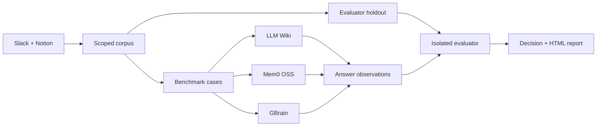
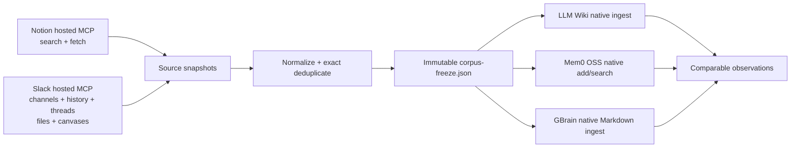

# AutoBrain

<p align="center">
  <strong>Choose the scope. Let AutoBrain design the experiment.</strong>
  <br />
  A terminal-first, evidence-backed bake-off for Slack and Notion knowledge systems.
</p>

<p align="center">
  <a href="https://github.com/runbear-io/AutoBrain">
    
  </a>
  <a href="https://www.python.org/">
    
  </a>
  <a href="https://docs.astral.sh/uv/">
    
  </a>
  <a href="https://github.com/runbear-io/AutoBrain/blob/main/pyproject.toml">
    
  </a>
</p>

AutoBrain turns a vague platform question into one inspectable experiment:

> Given our real Slack and Notion knowledge, which architecture answers our
> questions most accurately, with acceptable latency, evidence quality, and
> operational cost?

It does not rank vendors from a toy dataset. It builds a bounded corpus,
generates benchmark cases from that corpus, runs the same cases through a
fixed candidate set, evaluates the answers against held-out evidence, and
leaves a report you can reopen after the run.

The default experience is an interactive terminal cockpit. You choose only
the connections, knowledge-source scope, and candidates. AutoBrain chooses the
first experiment, question count, budget guard, and remaining run parameters.

## Why AutoBrain

Most AI knowledge evaluations fail in one of two ways:

1. The questions are synthetic, so the result does not represent the team.
2. The evidence and evaluation set overlap, so the score is quietly inflated.

AutoBrain is designed around the opposite defaults:

- **Real questions** from the connected knowledge sources.
- **Candidate-visible corpus** separated from **evaluator holdout evidence**.
- **Native candidate lifecycles** instead of forcing every system into one fake
  retriever abstraction.
- **Run-local metering** with a hard budget boundary.
- **Typed blockers** when authentication, capability, or evidence is missing.
- **Durable artifacts** for the corpus, benchmark, observations, decision, and
  HTML report.

## How it works



Every run is a new immutable run directory. A failed run remains inspectable;
the next invocation receives a new run ID rather than silently resuming or
overwriting previous evidence.

## Terminal cockpit

After installing AutoBrain once, run it without a subcommand:

```bash
autobrain
```

```text
AUTOBRAIN
One grounded experiment. You choose connections, sources, and candidates.

> 1  Connections
   [C] ChatGPT      connected      (reconnect)
   [S] Slack        connected      (reconnect)
   [N] Notion       connected      (reconnect)

  2  Knowledge Sources
   [1] [x] Slack
   [2] [x] Notion

  3  Candidates
   [1] [x] LLM Wiki
   [2] [x] Mem0 OSS
   [3] [x] GBrain

  4  Automatic Experiment
   Find the best knowledge system for Slack + Notion
   Compare LLM Wiki, Mem0 OSS, GBrain on grounded questions from Slack + Notion.
   Provider     ChatGPT subscription
   Questions    automatic, up to 30
   Budget guard automatic, $25
```

The cockpit requires an interactive terminal of at least `60x23` cells.
Smaller terminals show a resize message and do not allow hidden setup state to
change.

### What you choose

| Setup section | Available choices |
| --- | --- |
| **Connections** | ChatGPT subscription, Slack, Notion |
| **Knowledge Sources** | Slack and/or Notion |
| **Candidates** | LLM Wiki, Mem0 OSS, GBrain |

All sources and candidates start selected. A runnable experiment requires at
least one knowledge source and at least two candidates.

### What AutoBrain decides

| Decision | Automatic behavior |
| --- | --- |
| Experiment | Generates a title and description from the selected scope |
| Provider | Uses the connected ChatGPT subscription |
| Questions | Up to 20 for one source, up to 30 for both sources |
| Budget | `$25` hard guard |
| Execution | Builds only the selected connectors and native candidate adapters |
| Output | Writes a new immutable run and evidence-backed result |

If the ChatGPT subscription is unavailable, AutoBrain returns its exact typed
status, such as `SUBSCRIPTION_AUTH_UNAVAILABLE`, instead of pretending the
experiment ran. Disconnected selected sources similarly produce
`SOURCE_AUTH_UNAVAILABLE`.

### Keyboard map

| Key | Action |
| --- | --- |
| `C` / `S` / `N` | Start the user-driven ChatGPT, Slack, or Notion connection flow |
| `1` / `2` | Toggle Slack or Notion on the Knowledge Sources step |
| `1` / `2` / `3` | Toggle LLM Wiki, Mem0 OSS, or GBrain on the Candidates step |
| `Enter` | Advance or run the reviewed automatic experiment |
| `B`, `Backspace`, `Up` | Go back |
| `Tab`, `Down` | Advance |
| `O` | Open a generated report from Results |
| `R` | Return to the experiment review |
| `Q` | Quit while the experiment is not running |

While an experiment is running, navigation, toggles, quit, and duplicate-run
keys are disabled until the worker returns a result.

## What is evaluated

The candidate set is intentionally fixed:

| Candidate | What AutoBrain exercises |
| --- | --- |
| **LLM Wiki** | Ingest, retrieval, and answer behavior through its native lifecycle |
| **Mem0 OSS** | Memory ingestion and answer behavior through its native lifecycle |
| **GBrain** | Native initialization, import, sync, search, and query behavior |

Current connector scope is intentionally narrow:

- Slack
- Notion

Google Drive and other sources are out of scope for this repository. MCP
coverage is reported only for the exposed read surfaces; it is not described as
an exhaustive audit of every source API.

## Quickstart

### 1. Install once

AutoBrain is a Python CLI, so its global-package equivalent of
`npm install -g` is `uv tool install`:

```bash
uv tool install git+https://github.com/runbear-io/AutoBrain.git
```

If `uv` is not installed yet:

```bash
curl -LsSf https://astral.sh/uv/install.sh | sh
uv tool install git+https://github.com/runbear-io/AutoBrain.git
```

From then on, open the cockpit from any directory with:

```bash
autobrain
```

Upgrade or remove the global tool with:

```bash
uv tool upgrade autobrain
uv tool uninstall autobrain
```

The cockpit never performs a hidden login. If a connection is unavailable,
press `C`, `S`, or `N` to temporarily leave the full-screen UI and start that
explicit connection flow.

### 2. Inspect local capabilities

```bash
autobrain doctor --json
autobrain auth status --json
autobrain subscription status --json
```

The doctor and status commands report typed states. Missing credentials are
never converted into a successful empty run.

### 3. Review and run

Keep the default scope or toggle sources and candidates. The Automatic
Experiment section updates from the current selection. Press `Enter` from that
section to start the run.

AutoBrain shows elapsed time while running, then displays candidate scores,
status, verdict, and report availability. If a report was generated, press `O`
to open it.

## Connections

### Slack and Notion

Press `N` or `S` in the TUI to leave the full-screen view temporarily and run
the same explicit browser OAuth flows available from the CLI.

Notion uses the hosted read-only Notion MCP server with dynamic client
registration, so users do not need to create or paste a Notion API token:

```bash
autobrain auth notion
```

Slack also uses a hosted read-only MCP server, but the current Slack MCP OAuth
flow requires a fixed Slack app client. The app operator must configure
`http://127.0.0.1:8765/oauth/callback` as a redirect URL and provide its
credentials before the user authorizes the workspace:

```bash
export AUTOBRAIN_SLACK_CLIENT_ID="<slack-app-client-id>"
export AUTOBRAIN_SLACK_CLIENT_SECRET="<slack-app-client-secret>"
autobrain auth slack
```

Inspect both connection states without starting a crawl:

```bash
autobrain auth status --json
```

OAuth access and refresh tokens are stored in the OS keychain under the
`autobrain.oauth` service. If the keychain is unavailable, AutoBrain uses a
confined `0600` fallback under `~/.autobrain/auth/` and reports the degraded
storage state.

### How source content becomes candidate input

Both sources cross the same read-only and run-local pipeline:



Notion discovery calls `notion-search` and then `notion-fetch` for each
accessible document. Slack enumerates authorized public and private channels,
reads channel history and thread replies, and reads referenced files or
canvases when those capabilities are advertised. Direct messages are excluded
from the default scope.

The connectors never write back to either service. MCP results are treated as
untrusted data and only explicitly allowlisted read tools can run. Each source
item is converted to the shared `NormalizedDocument` contract:

- source kind and stable source ID
- canonical URL and title
- complete text
- SHA-256 content hash
- timestamps, source references, provenance, and safe metadata

Source-specific transport fields are removed at this boundary, exact duplicate
content is collapsed deterministically, and benchmark holdouts are separated
before any candidate sees the corpus.

The normalized candidate-visible snapshot is stored at:

```text
~/.autobrain/runs/<run-id>/corpus-freeze.json
```

All selected candidates receive that same frozen snapshot. Their adapters then
translate each normalized document into the candidate's native ingestion
surface: LLM Wiki documents, Mem0 scoped memories, or GBrain Markdown sources.
Native indexes are isolated to that run and cleaned up when required; durable
evidence remains in the run directory as the corpus freeze, candidate
observations, comparison JSON, manifest, and HTML report. AutoBrain is an
evaluation runner, not a permanent Slack or Notion mirror.

### Personal ChatGPT subscription

Subscription mode uses a local Codex CLI login for generation. Install and
authenticate the Codex CLI according to its official documentation, then let
AutoBrain start the user-driven login flow:

```bash
codex --help
autobrain subscription setup
autobrain subscription status --json
```

Run the same evaluation through the local subscription bridge:

```bash
autobrain run \
  --provider codex-subscription \
  --budget-usd 25 \
  --max-questions 30 \
  --no-open
```

AutoBrain does not collect or persist a ChatGPT password or browser token.
Generation is sent through a local `codex exec` boundary using an ephemeral,
read-only sandbox.

## Headless automation

The TUI is a thin interface over the existing orchestration path. Scripts and
CI can continue to configure provider, budget, question count, output, and
report-opening behavior explicitly:

```bash
autobrain run \
  --provider codex-subscription \
  --budget-usd 25 \
  --max-questions 30 \
  --no-open
```

```bash
autobrain run --help
```

The headless command currently runs the complete fixed Slack/Notion and
LLM Wiki/Mem0 OSS/GBrain comparison. Interactive source and candidate scope
selection belongs to the cockpit flow. Both interfaces use the same immutable
run lifecycle, metering, evaluation, and reporting boundaries.

## Why subscription mode does not need OpenAI embeddings

The native candidate implementations historically requested
`text-embedding-3-small` for retrieval. In subscription mode, those requests
are intercepted by the run-local provider proxy and answered by the local
`local-hash-embedding` backend.

```text
ChatGPT subscription  -> generation
Local hash embedding  -> retrieval vectors
```

This removes OpenAI embedding billing from subscription mode while preserving
the candidate lifecycle and OpenAI-compatible boundary used by the adapters.
The trade-off is explicit: a deterministic local hash embedding is not a
semantic model. Retrieval quality is therefore part of the experiment's
evidence and must not be silently compared as if it were the hosted embedding
model.

Subscription usage is also not native provider billing telemetry. AutoBrain
does not report that unknown usage as `$0`; cost remains incomplete when the
provider does not expose authoritative usage.

## CLI map

```text
autobrain                                Open the interactive terminal cockpit
autobrain doctor                         Inspect local capability states
autobrain auth                           Manage source auth and connection status
autobrain subscription setup             Start user-driven ChatGPT login
autobrain subscription status            Check local subscription capability
autobrain subscription ask               Run one read-only subscription prompt
autobrain run                            Execute a new evaluation run
autobrain report                         Reopen an existing report
```

Useful help commands:

```bash
autobrain --help
autobrain run --help
autobrain auth --help
autobrain subscription --help
```

## Run artifacts

Each run writes to the local AutoBrain run root and records the evidence needed
to understand the result:

```text
<run-root>/<run-id>/
├── manifest.json                 Run configuration and stage metadata
├── corpus-freeze.json            Scoped candidate-visible documents
├── candidates/<candidate>.json   Candidate answers and timings
├── evaluator/holdout.json        Evaluator-only evidence
├── comparison.json               Scores, blockers, and recommendation
└── report.html                   Reopenable human-readable report
```

To reopen a completed run:

```bash
autobrain report <run-id>
```

The report is an evidence surface, not a magic confidence score. Read the
status, blocker, coverage, cost, and holdout sections before treating a result
as a decision.

## Safety and privacy boundaries

AutoBrain is deliberately conservative at external boundaries:

- Slack and Notion content is treated as untrusted input.
- Only read tools are allowlisted for source collection.
- Candidate-visible documents and evaluator holdout evidence are kept separate.
- Credentials are redacted from artifacts and error details.
- Candidate execution runs through a run-local metering boundary.
- Budget exhaustion and cancellation are surfaced as typed outcomes.
- Missing OAuth, provider credentials, or capability is not reported as success.
- Slack and Notion sources are never mutated or published by the evaluation
  workflow. Scoped corpus content may be sent to the user-selected candidate
  provider for evaluation; that provider boundary is visible in the run
  configuration and report.

Read the longer security notes in
[`docs/security-and-privacy.md`](docs/security-and-privacy.md).

## Repository layout

```text
src/autobrain/
├── benchmark.py         Build benchmark cases and holdouts
├── candidates/          Native LLM Wiki, Mem0, and GBrain adapters
├── cli.py               Typer command surface
├── connectors/          Slack and Notion read connectors
├── decision.py          Evidence-aware scoring and decision policy
├── evaluate.py          Isolated evaluator
├── experiment.py        Automatic TUI experiment planning
├── metering.py          Run-local budget and usage boundary
├── orchestration.py     End-to-end run lifecycle
├── production.py        Selected production connectors and candidates
├── report.py            Report generation and reopening
├── subscription.py      Codex bridge and local embedding backend
├── terminal_text.py     Unicode-safe terminal width handling
├── tui.py               Curses event loop and worker coordination
├── tui_render.py        Pure size-bounded terminal renderer
├── tui_runtime.py       Connection and orchestration bridge
└── tui_state.py         Immutable cockpit state machine

docs/
├── methodology.md
├── report-reading-guide.md
└── security-and-privacy.md
```

## Development

AutoBrain uses Python, `uv`, pytest, Ruff, and basedpyright.

```bash
uv sync

# Fast feedback
uv run pytest tests/test_subscription.py -q
uv run ruff check .
uv run ruff format --check .
uv run basedpyright

# Full validation
uv run pytest -q
uv build --offline
```

The current validated baseline is:

```text
390 passed, 3 skipped
0 Ruff violations
0 basedpyright errors
```

The skipped cases are environment-dependent capabilities rather than silently
converted successes.

## Documentation

- [Methodology](docs/methodology.md)
- [How to read a report](docs/report-reading-guide.md)
- [Security and privacy](docs/security-and-privacy.md)
- [Candidate pins](candidate-pins.json)
- [Design notes](DESIGN.md)

## Known limitations

AutoBrain is an experimental decision-support tool, not a hosted production
knowledge platform. In particular:

1. Real Slack and Notion evaluation requires the user to complete the
   corresponding authorization flows.
2. Real subscription success cannot be claimed until the local Codex login is
   completed and a live prompt is observed.
3. Subscription mode uses local hash embeddings, so its retrieval behavior is
   not equivalent to a hosted semantic embedding model.
4. Provider usage and cost may be incomplete when the subscription bridge does
   not expose authoritative telemetry.
5. The candidate set and connector scope are intentionally limited to the
   surfaces listed above.
6. A benchmark score is evidence for the captured corpus and questions, not a
   universal ranking of knowledge systems.
7. The interactive cockpit requires a TTY with at least `60x23` terminal
   cells; non-interactive environments should use `autobrain run`.

If one of these limitations changes, the report contract and README should
change with it.
