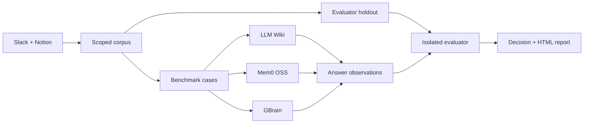

# AutoBrain

<p align="center">
  <strong>Find the right AI knowledge architecture before you commit to one.</strong>
  <br />
  A reproducible, evidence-first bake-off for Slack and Notion knowledge systems.
</p>

<p align="center">
  <a href="https://github.com/runbear-io/AutoBrain">
    
  </a>
  <a href="https://www.python.org/">
    
  </a>
  <a href="https://docs.astral.sh/uv/">
    
  </a>
  <a href="https://github.com/runbear-io/AutoBrain/blob/main/pyproject.toml">
    
  </a>
</p>

AutoBrain turns a vague platform question into an inspectable decision:

> Given our real Slack and Notion knowledge, which architecture answers our
> questions most accurately, with acceptable latency, evidence quality, and
> operational cost?

It does not rank vendors from a toy dataset. It builds a bounded corpus,
generates benchmark cases from that corpus, runs the same cases through a
fixed candidate set, evaluates the answers against held-out evidence, and
leaves a report you can reopen after the run.

## Why AutoBrain

Most AI knowledge evaluations fail in one of two ways:

1. The questions are synthetic, so the result does not represent the team.
2. The evidence and evaluation set overlap, so the score is quietly inflated.

AutoBrain is designed around the opposite defaults:

- **Real questions** from the connected knowledge sources.
- **Candidate-visible corpus** separated from **evaluator holdout evidence**.
- **Native candidate lifecycles** instead of forcing every system into one fake
  retriever abstraction.
- **Run-local metering** with a hard budget boundary.
- **Typed blockers** when authentication, capability, or evidence is missing.
- **Durable artifacts** for the corpus, benchmark, observations, decision, and
  HTML report.

## How it works



Every run is a new immutable run directory. A failed run remains inspectable;
the next invocation receives a new run ID rather than silently resuming or
overwriting previous evidence.

## What is evaluated

The candidate set is intentionally fixed:

| Candidate | What AutoBrain exercises |
| --- | --- |
| **LLM Wiki** | Ingest, retrieval, and answer behavior through its native lifecycle |
| **Mem0 OSS** | Memory ingestion and answer behavior through its native lifecycle |
| **GBrain** | Native initialization, import, sync, search, and query behavior |

Current connector scope is intentionally narrow:

- Slack
- Notion

Google Drive and other sources are out of scope for this repository. MCP
coverage is reported only for the exposed read surfaces; it is not described as
an exhaustive audit of every source API.

## Quickstart

### 1. Install the project

Install [`uv`](https://docs.astral.sh/uv/getting-started/installation/), then:

```bash
git clone https://github.com/runbear-io/AutoBrain.git
cd AutoBrain

uv sync
uv run autobrain --help
```

### 2. Check local prerequisites

```bash
uv run autobrain doctor --json
```

The doctor command reports typed states instead of treating missing credentials
as a successful empty run.

### 3. Connect knowledge sources

Use the source-specific auth flow exposed by the CLI:

```bash
uv run autobrain auth --help
uv run autobrain auth status --json
```

Slack and Notion connections are user-authorized and local. AutoBrain only
allowlists read operations for connected knowledge sources.

### 4. Choose a generation provider

#### OpenAI-compatible API mode

Set the provider credential through your environment or approved secret
manager:

```bash
export OPENAI_API_KEY="..."
```

Then run:

```bash
uv run autobrain run \
  --provider api \
  --budget-usd 25 \
  --max-questions 30 \
  --no-open
```

#### Personal ChatGPT subscription mode

Subscription mode uses a local Codex CLI login for generation. Install and
authenticate the Codex CLI according to its official documentation, then let
AutoBrain start the user-driven login flow:

```bash
codex --help
uv run autobrain subscription setup
uv run autobrain subscription status --json
```

Run the same evaluation through the local subscription bridge:

```bash
uv run autobrain run \
  --provider codex-subscription \
  --budget-usd 25 \
  --max-questions 30 \
  --no-open
```

AutoBrain does not collect or persist a ChatGPT password or browser token.
Generation is sent through a local `codex exec` boundary using an ephemeral,
read-only sandbox.

## Why subscription mode does not need OpenAI embeddings

The native candidate implementations historically requested
`text-embedding-3-small` for retrieval. In subscription mode, those requests
are intercepted by the run-local provider proxy and answered by the local
`local-hash-embedding` backend.

```text
ChatGPT subscription  -> generation
Local hash embedding  -> retrieval vectors
```

This removes OpenAI embedding billing from subscription mode while preserving
the candidate lifecycle and OpenAI-compatible boundary used by the adapters.
The trade-off is explicit: a deterministic local hash embedding is not a
semantic model. Retrieval quality is therefore part of the experiment's
evidence and must not be silently compared as if it were the hosted embedding
model.

Subscription usage is also not native provider billing telemetry. AutoBrain
does not report that unknown usage as `$0`; cost remains incomplete when the
provider does not expose authoritative usage.

## CLI map

```text
autobrain doctor                         Inspect local capability states
autobrain auth                           Manage source auth and connection status
autobrain subscription setup             Start user-driven ChatGPT login
autobrain subscription status            Check local subscription capability
autobrain subscription ask               Run one read-only subscription prompt
autobrain run                            Execute a new evaluation run
autobrain report                         Reopen an existing report
```

Useful help commands:

```bash
uv run autobrain --help
uv run autobrain run --help
uv run autobrain auth --help
uv run autobrain subscription --help
```

## Run artifacts

Each run writes to the local AutoBrain run root and records the evidence needed
to understand the result:

```text
<run-root>/<run-id>/
├── manifest.json                 Run configuration and stage metadata
├── corpus-freeze.json            Scoped candidate-visible documents
├── candidates/<candidate>.json   Candidate answers and timings
├── evaluator/holdout.json        Evaluator-only evidence
├── comparison.json               Scores, blockers, and recommendation
└── report.html                   Reopenable human-readable report
```

To reopen a completed run:

```bash
uv run autobrain report <run-id>
```

The report is an evidence surface, not a magic confidence score. Read the
status, blocker, coverage, cost, and holdout sections before treating a result
as a decision.

## Safety and privacy boundaries

AutoBrain is deliberately conservative at external boundaries:

- Slack and Notion content is treated as untrusted input.
- Only read tools are allowlisted for source collection.
- Candidate-visible documents and evaluator holdout evidence are kept separate.
- Credentials are redacted from artifacts and error details.
- Candidate execution runs through a run-local metering boundary.
- Budget exhaustion and cancellation are surfaced as typed outcomes.
- Missing OAuth, provider credentials, or capability is not reported as success.
- Slack and Notion sources are never mutated or published by the evaluation
  workflow. Scoped corpus content may be sent to the user-selected candidate
  provider for evaluation; that provider boundary is visible in the run
  configuration and report.

Read the longer security notes in
[`docs/security-and-privacy.md`](docs/security-and-privacy.md).

## Repository layout

```text
src/autobrain/
├── benchmark.py         Build benchmark cases and holdouts
├── candidates/          Native LLM Wiki, Mem0, and GBrain adapters
├── cli.py               Typer command surface
├── connectors/          Slack and Notion read connectors
├── decision.py          Evidence-aware scoring and decision policy
├── evaluate.py          Isolated evaluator
├── metering.py          Run-local budget and usage boundary
├── orchestration.py     End-to-end run lifecycle
├── report.py             Report generation and reopening
└── subscription.py      Codex bridge and local embedding backend

docs/
├── methodology.md
├── report-reading-guide.md
└── security-and-privacy.md
```

## Development

AutoBrain uses Python, `uv`, pytest, Ruff, and basedpyright.

```bash
uv sync

# Fast feedback
uv run pytest tests/test_subscription.py -q
uv run ruff check .
uv run ruff format --check .
uv run basedpyright

# Full validation
uv run pytest -q
uv build --offline
```

The current validated baseline is:

```text
371 passed, 3 skipped
0 Ruff violations
0 basedpyright errors
```

The skipped cases are environment-dependent capabilities rather than silently
converted successes.

## Documentation

- [Methodology](docs/methodology.md)
- [How to read a report](docs/report-reading-guide.md)
- [Security and privacy](docs/security-and-privacy.md)
- [Candidate pins](candidate-pins.json)
- [Design notes](DESIGN.md)

## Known limitations

AutoBrain is an experimental decision-support tool, not a hosted production
knowledge platform. In particular:

1. Real Slack and Notion evaluation requires the user to complete the
   corresponding authorization flows.
2. Real subscription success cannot be claimed until the local Codex login is
   completed and a live prompt is observed.
3. Subscription mode uses local hash embeddings, so its retrieval behavior is
   not equivalent to a hosted semantic embedding model.
4. Provider usage and cost may be incomplete when the subscription bridge does
   not expose authoritative telemetry.
5. The candidate set and connector scope are intentionally limited to the
   surfaces listed above.
6. A benchmark score is evidence for the captured corpus and questions, not a
   universal ranking of knowledge systems.

If one of these limitations changes, the report contract and README should
change with it.
